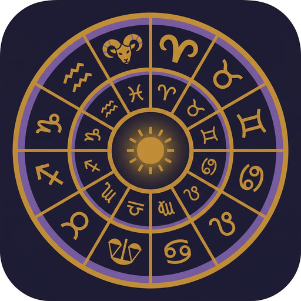

# Solar Return

A desktop application that calculates personalised solar return (birthday) astrology charts and generates multi-page PDF reports with chart wheel graphics.

Built with **Tauri v2 + React + TypeScript + Swiss Ephemeris (WebAssembly)**.



## Features

- **Swiss Ephemeris precision** — real astronomical calculations via `sweph-wasm`, using the Moshier ephemeris (no external data files needed)
- **Complete solar return charts** — 10 planets (Sun through Pluto), Placidus houses, 5 major aspects
- **Chart wheel graphic** — rendered directly in the PDF with planet positions, house cusps, sign divisions, and degree labels
- **750+ interpretation texts** — pre-written content covering planets in houses, planets in signs, aspects, SR/natal contacts, and calendar events
- **PDF report generation** — multi-page branded reports using pdf-lib (no external services)
- **City search** — 15,000 cities from GeoNames with autocomplete, auto-fills latitude/longitude/timezone
- **Noon chart support** — checkbox for unknown birth times, uses standard 12:00 PM with appropriate caveats on house-dependent placements
- **Report branding** — astrologers can add their company name, tagline, and contact info to generated reports (persisted across sessions)
- **Cross-chart analysis** — SR planet conjunctions to natal planets/angles
- **Year calendar** — transit events for the 12 months following the solar return

## Tech Stack

| Component | Technology |
|-----------|-----------|
| Framework | [Tauri v2](https://tauri.app/) |
| Frontend | React 19 + TypeScript |
| Build | Vite 8 |
| Calculations | [sweph-wasm](https://github.com/ptprashanttripathi/sweph-wasm) (Swiss Ephemeris compiled to WebAssembly) |
| PDF | [pdf-lib](https://pdf-lib.js.org/) |
| City data | [GeoNames](https://www.geonames.org/) cities15000 (CC-BY 3.0) |

## Getting Started

### Prerequisites

- [Node.js](https://nodejs.org/) 18+
- [Rust](https://rustup.rs/) (for Tauri)

### Install and Run

```bash
git clone https://github.com/dragontpe/solar-return.git
cd solar-return
npm install
npm run tauri dev
```

### Build for Production

```bash
npm run tauri build
```

The built app will be at `src-tauri/target/release/bundle/macos/Solar Return.app` (macOS) with a DMG installer alongside it.

### Run Tests

```bash
npm test
```

The verification test uses Meryl Streep's public birth data (June 22, 1949, Summit NJ) and validates the 2027 solar return against known values from Astro.com.

## Project Structure

```
solar-return/
├── src/
│   ├── engine/          # Swiss Ephemeris calculation engine
│   │   ├── swe.ts       # WASM initialisation
│   │   ├── chart.ts     # Chart calculation (planets, houses, aspects)
│   │   ├── solarreturn.ts # Solar return moment finder (binary search)
│   │   ├── crosschart.ts  # SR/natal overlay contacts
│   │   ├── calendar.ts    # Year transit events
│   │   └── index.ts       # Main orchestrator
│   ├── content/         # 22 interpretation text files (~750 texts)
│   ├── report/          # Report assembler (engine output -> structured report)
│   ├── pdf/             # PDF generator + chart wheel renderer
│   ├── components/      # City search, branding settings
│   ├── screens/         # Input, Calculating, Result screens
│   └── data/            # Cities database (GeoNames)
└── src-tauri/           # Tauri backend (Rust)
```

## How It Works

1. User enters birth data + return year/location (or searches for a city)
2. Engine calculates the natal chart and finds the exact solar return moment (when the transiting Sun returns to its natal longitude)
3. SR chart is cast for the return location at the exact return moment
4. Assembler looks up interpretation texts keyed by placement (e.g. Sun in 3rd house, Aries Ascendant)
5. PDF generator renders a cover page, chart wheel, interpretation sections, and year calendar

## Calculation Details

- **Ephemeris**: Moshier (analytical, built into sweph-wasm — no external `.se1` files)
- **House system**: Placidus
- **Planets**: Sun, Moon, Mercury, Venus, Mars, Jupiter, Saturn, Uranus, Neptune, Pluto
- **Aspects**: Conjunction (8°), Sextile (6°), Square (8°), Trine (8°), Opposition (8°)
- **Solar return precision**: Binary search to within 0.000001° of natal Sun longitude (~0.08 seconds of time)

## Acknowledgements

- [Swiss Ephemeris](https://www.astro.com/swisseph/) by Astrodienst AG
- [GeoNames](https://www.geonames.org/) geographic database (CC-BY 3.0)
- Interpretation texts informed by Mary Fortier Shea's *Planets in Solar Returns*, Cafe Astrology, and Robert Hand's *Planets in Transit*

## License

[MIT](LICENSE)

---

City data from [GeoNames](https://www.geonames.org/) is used under the [Creative Commons Attribution 3.0 License](https://creativecommons.org/licenses/by/3.0/).
